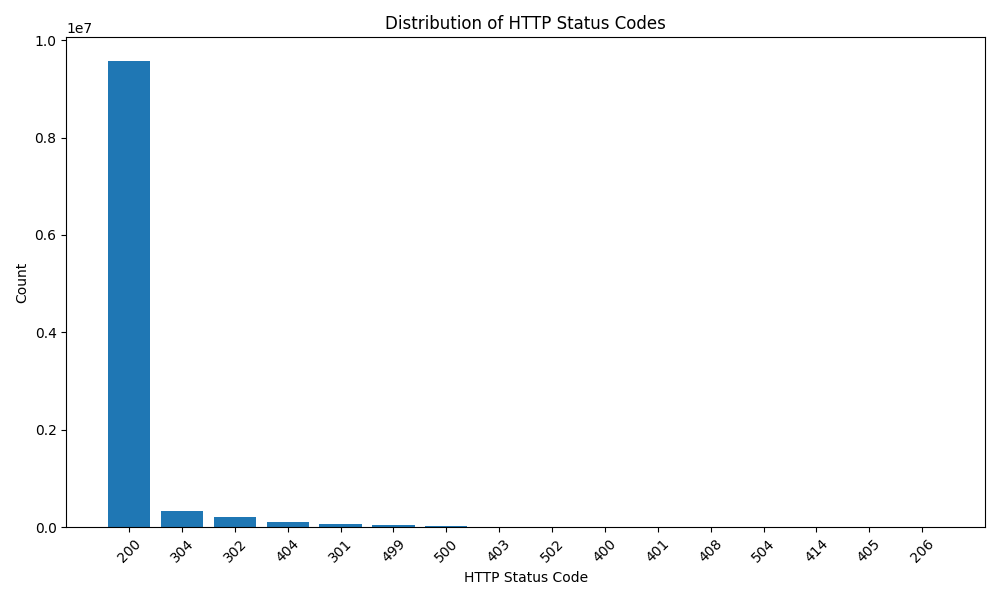

# Cloud and Big Data

**[Course project]**

This is a PoC end-to-end application that serves to show the application of Cloud and Big Data principles.

### Description

The idea is to analyze large-scale log files from a website to identify traffic patterns, user behavior, and peak usage
hours.
In order to have a healthy working application it's necessary to monitor the activity for potential anomalies or
attacks.

Log files grow very rapidly, which requires distributed processing and storage.
Having multiple services running and being able to monitor them quickly becomes difficult, because of sheer volume of
data being produced.
Even simple HTTP APIs produce a large amount of log records, not including the metrics used for monitoring the
application.

### Data

[Link to dataset](
https://www.kaggle.com/datasets/eliasdabbas/web-server-access-logs
) (Size 3.5GB)

The dataset represents a log file from a web service.
Every log record represents user or bot traffic towards the site.
The log format is represented as a standard Apache HTTP Server
access log format.

### Application

The idea was to make a cloud native application that could be easily adopted to a local or a cloud environment.
This is a CLI application that is intended to be used in batch processing scenarios.
It uses Apache Spark under the hood and is written in python.
The application works with locally available data and files, but it can easily be interfaced to work
with cloud storage or Dataproc clusters used to run the Spark machinery.
That also includes the ML model used, which can be easily packaged as a standalone application and used through a
network API.
The principle of how the application works stays the same, only the input/output streams change (application is
stateless and can be easily distributed).
The only dependencies this application must have are the libraries used to communicate with the necessary
part of the system (for example, google-cloud-storage to interface with the Bucket Storage on Google Cloud).
It's intended use it to orchestrate small parts of infrastructure (and Spark) over some data and is best used as a
lambda, a scheduled (CRON) job or something similar that runs when necessary.
Data flow of the application is as follows:

```text
(Raw Data) -> [Spark] -> (Structured Data) -> [ML Model] -> (Analysis)
                            or directly    -> [Analysis]
```

Raw logs get reduced to useful structured data which can then be used for direct analysis or training an ML model for
detection of suspicious traffic.
The project structure is as follows:

```text
project/
├─ logs.py
├─ data/
├─ src/
│  ├─ callback/
│  │  ├─ [job]_cb.py
│  │  └─ ...
│  ├─ config.py
│  ├─ model.py
│  └─ spark_jobs.py
├─ spark_jobs/
│  ├─ [job].py
│  └─ ...
├─ misc/
└─ config.yaml
```

`logs.py` is the entrypoint to the application.
`spark_jobs` folder is used to store any spark jobs that the framework engine will execute to get the data.
Job names are used as identifiers for other things down the pipeline.
The `src` directory contains the source code of the application.
The application is made to be stateless and can be easily configured through the `config.yaml` file which modifies the
behaviour of the app.
This improves repeatability which makes the application usage and deployment more reliable in distributed systems.
`data` folder contains the logs used.
The configuration controls the input/output settings and general spark configuration that can be used when submitting
jobs to the engine.
`callback` folder is one of the "generic" steps made to be used in the pipeline.
In this case, a callback function defined in the file prefixed with the job name will be executed after the completion
of a job.
For example, here it can be used to read the `csv` output from the finished job, take the data and create a
visualisation.
The `misc` folder is used in this case. It's a transient folder for any useful outputs or state that will be collected
(and cleaned up after) when the analysis finishes.

### Usage

The application itself has a small footprint of options it can be used with.
Most of the configuration goes through the `config.yaml` file.

```shell
$ python logs.py --help
usage: logs.py [-h] [--run-callbacks] [--analyze] [--spark-args SPARK_ARGS]

Logs CLI program.

options:
  -h, --help            show this help message and exit
  --run-callbacks       Run a callback function after the job is complete
  --analyze             Train a classification model to find anomalies
  --spark-args SPARK_ARGS
                        Additional arguments for the submit task
```

Default configuration (`logs.py` file):

```yaml
app:
  pwd: pwd
  spark:
    jobs: spark_jobs
    data: data
    output: output
    callbacks: false
    args: ''
  ml:
    enabled: false
    job: null
```

**Usage - showcase**

> **NOTE:** Having Docker or Docker desktop is required to run the showcase.

> **NOTE:** Put the dataset tarball (access.log.tar) from the link above into the `data/` folder. You can customize the
> behaviour in the `startup.sh` script.

Even though the focus is on analyzing web traffic, the application is a bit more generic and can run any arbitrary
Spark job.
To show the whole process and the usage of the application, run the `./run.sh` script in the terminal.
It should run a `docker compose` file with the application and it's dependencies, and install all the necessary tooling.
There is also an interactive option (`./run.sh --interactive`) for debugging purposes.
If there are any changes made to the files here, the `run.sh` has to be rerun, and it will copy/update the mounted files
in the container.

**Example output:**

`response_codes` output:



`IsolationForest` example model:

```text
Running a ML model to detect anomalies
Training the model...
Number of anomalies detected: 102203
Total records: 10365152
Anomaly ratio: 0.99%

Sample anomaly rows:
     status  bytes  endpoint_length  method_index
98      500  33983           1367.0           0.0
115     404      0             89.0           2.0
234     200    371           1351.0           0.0
237     404      0             89.0           2.0
364     404      0             89.0           2.0

Descriptive statistics of anomaly features:
              status         bytes  endpoint_length   method_index
count  102203.000000  1.022030e+05    102160.000000  102203.000000
mean      332.735164  4.879500e+04       680.192580       0.697455
std       128.444992  1.467635e+05       721.907132       1.072945
min       200.000000  0.000000e+00         1.000000       0.000000
25%       200.000000  0.000000e+00        89.000000       0.000000
50%       301.000000  3.330000e+02       196.000000       0.000000
75%       499.000000  7.130000e+02      1351.000000       2.000000
max       504.000000  1.126965e+06      8188.000000      43.000000
```

### Performance

Bulk of the performance bottleneck is in the Spark engine's ability to crunch the necessary logs into useful data
constructs.
Changing just the `--num-executors` or `--executor-cores` settings noticeably increases the performance on the dataset.
Creating a Dataproc cluster improves it even more since the load can be distributed on different physical machines
instead of just threads on a single machine.
It makes more sense for very large datasets because the housekeeping costs can very much overshadow the single-machine
performance on smaller datasets.

The other part of performance lays in training the ML model with new data.
Training the model all over again, all the time is very inefficient and costly.
The problem can be mitigated by making snapshots of the model every time it receives new data, and it can be saved to a
file system or a database for later use.

### Advanced features

One of the "advanced" features used is the ML model for classifying the anomalies in the traffic.
In this case it is used directly, locally, but in a more realistic scenario it will land as a standalone application or
node in a distributed system accessible through its public (mostly HTTP or gRPC) API.
That would not change the flow of the application since the only thing changing would be the communication interface and
it would make maintenance easier.

### Conclusions

The goal was to make a specific (PoC) end-to-end application, but we have made a bit more general solution.
This type of batch processing makes sense in a lot of network-traffic related scenarios and is the way to go.
On the other hand, a viable solution would be to use pub/sub or streaming architecture for analyzing the web traffic and
training the model.
If the service must have an almost 100% uptime and handle a lot of throughput, it would make much more sense to detect
anomalies and/or attacks in real time and prevent any damage if possible.
It would also not make much more of a problem for training the model, since snapshots can be used to have the most
up-to-date predictions.
The application can be extended with a lot more functionality and control over how the data should be processed and
resources managed, while adding the much-needed interfaces for direct cloud integration and better scalability.